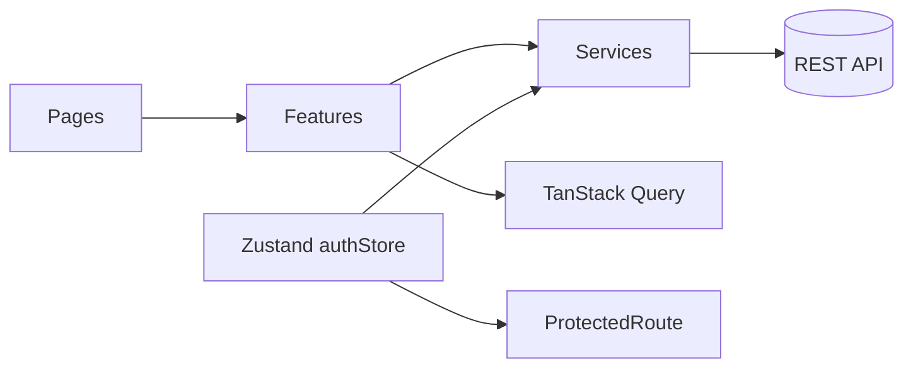

# Kiến trúc

## Luồng dữ liệu



## Phân lớp

### `pages/`

Chỉ ghép component và hook — không gọi axios trực tiếp.

- `HomePage` — Hero search, Categories, Featured Jobs, Locations
- `JobListingPage` — Search, Filters, Pagination
- `JobDetailPage` — Full info, Related Jobs
- `LoginPage`, `RegisterPage` — Auth forms

### `features/`

Logic theo domain:

- `features/auth` — đăng nhập/đăng ký, Zustand store, form
- `features/job` — danh sách, chi tiết, filters, `JobCard`, `JobFiltersBar`, hooks query

Mỗi feature có thể có: `components/`, `hooks/`, `store/`, `types.ts`, `utils.ts`, `index.ts`.

### `services/`

Lớp API duy nhất dùng `apiClient` (axios):

- `client.ts` — instance, interceptor token, 401 → logout
- `authService.ts`, `jobService.ts` — mock/real API switching

### `shared/`

Dùng chung toàn app:

- `components/ui` — Button, Input, Pagination, LoadingState, ErrorState, ErrorBoundary, FormError
- `components/layout` — Layout, Header, Footer
- `components/routing` — ProtectedRoute, GuestRoute
- `constants/queryKeys.ts` — key TanStack Query (list, detail, featured, categories, locations)
- `lib/queryClient.ts` — cấu hình QueryClient (staleTime, gcTime)
- `lib/delay.ts` — shared mock delay utility

## Auth (Zustand)

- State: `token`, `user` trong `useAuthStore`
- Persist: `localStorage` qua `STORAGE_KEYS`
- Hook facade: `useAuth()` trong `shared/hooks`
- Mutations: `useLogin`, `useRegister` (TanStack Query `useMutation`)

## Routing

`shared/routes/routes.tsx` — `createBrowserRouter` + lazy loading:

- Tất cả pages lazy-loaded via `React.lazy()` + `Suspense`
- `GuestRoute` — chuyển hướng nếu đã đăng nhập
- `ProtectedRoute` — yêu cầu đăng nhập, lưu `from` để redirect sau login

## Query keys

Luôn khai báo trong `shared/constants/queryKeys.ts`:

```ts
queryKeys.jobs.all
queryKeys.jobs.list(filters, page)
queryKeys.jobs.detail(id)
queryKeys.jobs.featured
queryKeys.jobs.categories
queryKeys.jobs.locations
```

## Job Types

```ts
type Job = {
  id, title, company, location, description, postedAt,
  category: JobCategory,        // engineering | design | marketing | ...
  employmentType: EmploymentType, // full-time | part-time | contract | internship
  salary: SalaryRange,          // { min, max, currency }
  requirements: string[],
  benefits: string[],
  isFeatured: boolean,
}
```

## Filtering & Pagination

- `JobFilters` — search, category, employmentType, datePosted, salaryMin/Max, location
- `PaginatedJobs` — items, total, page, pageSize, totalPages
- `useJobs(filters, page)` — TanStack Query with `placeholderData` for smooth UX

## Mock API

`configs/env.ts` → `enableMockApi`:

- Dev: mặc định `true` (trừ khi `VITE_ENABLE_MOCK_API=false`)
- Production: chỉ khi `VITE_ENABLE_MOCK_API=true`

Services trả mock data khi `enableMockApi` — 12 mock jobs covering all categories/types.

## Performance

- **Code splitting**: Lazy-loaded routes giảm initial bundle
- **React Compiler**: Auto-memoization
- **Query placeholderData**: Giữ data cũ trong khi fetch mới (smooth pagination)
- **gcTime**: 5 phút garbage collection cho TanStack Query cache

## Security

- **ErrorBoundary**: Global error catching, không leak error details
- **401 interceptor**: Auto-logout khi token hết hạn
- **No `dangerouslySetInnerHTML`**: React auto-escapes
- **TypeScript strict**: Catch null/undefined tại compile time
